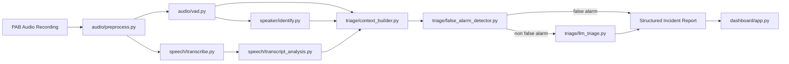

# pab-ai-triage

`pab-ai-triage` is a modular Python project for emergency triage from Personal Alert Button (PAB) audio. It processes a resident recording, identifies the likely speaker, transcribes and translates speech to English for normalized analysis, filters likely false alarms, and produces a structured report for operators.

## Architecture



## Project Structure

```text
pab-ai-triage/
├── audio/
│   ├── preprocess.py
│   └── vad.py
├── common/
│   ├── config.py
│   ├── logging_utils.py
│   └── schemas.py
├── dashboard/
│   └── app.py
├── examples/
│   ├── generate_test_audio.py
│   ├── run_test_pipeline.py
│   └── outputs/
├── pipeline/
│   └── main_pipeline.py
├── speaker/
│   ├── enroll.py
│   └── identify.py
├── speech/
│   ├── transcribe.py
│   └── transcript_analysis.py
├── triage/
│   ├── false_alarm_detector.py
│   └── llm_triage.py
├── voice_db/
├── .env.example
├── requirements.txt
└── README.md
```

## Pipeline Overview

1. Load and preprocess incoming audio.
2. Detect speech segments with VAD.
3. Use pyannote speaker embeddings to identify the resident.
4. Transcribe the audio with OpenAI `gpt-4o-mini-transcribe`.
5. Translate the transcript to English for normalized downstream reasoning.
6. Extract incident, symptoms, and keywords from the analysis transcript with an LLM-backed analyzer, then normalize symptom phrases into canonical labels.
7. Build transcript-first context from speech ratio, silence ratio, transcript presence, and speaker status.
8. Detect likely false alarms with an LLM-first detector plus heuristic fallback.
9. If not a false alarm, use `gpt-5-mini` by default for urgency reasoning.
10. Return a structured JSON incident report for operators and the dashboard.

## Installation

### 1. Create a virtual environment

```bash
python3 -m venv .venv
source .venv/bin/activate
pip install --upgrade pip
pip install -r requirements.txt
```

### 2. Configure environment variables

Copy `.env.example` to `.env` and fill in the required secrets:

```bash
cp .env.example .env
```

Required variables:

- `OPENAI_API_KEY`: required for transcription and LLM triage.
- `HF_TOKEN`: recommended for downloading gated or authenticated pyannote models from Hugging Face.

Optional variables:

- `OPENAI_TRANSCRIPTION_MODEL`: defaults to `gpt-4o-mini-transcribe`
- `OPENAI_TRANSLATION_MODEL`: defaults to `gpt-4.1-mini`
- `OPENAI_TRANSCRIPT_ANALYSIS_MODEL`: defaults to `gpt-4.1-mini`
- `OPENAI_FALSE_ALARM_MODEL`: defaults to `gpt-4.1-mini`
- `OPENAI_TRIAGE_MODEL`: defaults to `gpt-5-mini`
- `PAB_NOISE_REDUCTION`: `true` or `false`
- `PAB_VAD_AGGRESSIVENESS`: `0` to `3`

## API Key Setup

### OpenAI

1. Create an API key in the OpenAI platform.
2. Set it in `.env` as `OPENAI_API_KEY=...`.

### Hugging Face for pyannote

1. Create a Hugging Face access token.
2. Accept the model terms for the pyannote embedding model you plan to use.
3. Set it in `.env` as `HF_TOKEN=...`.

## How to Enroll Speakers

Each resident must be enrolled once with a clean voice sample. Enrollment writes a speaker embedding to `voice_db/<resident>.npy`.

```bash
python -m speaker.enroll --audio /path/to/resident_a.wav --speaker Resident_A
python -m speaker.enroll --audio /path/to/resident_b.wav --speaker Resident_B
```

After enrollment, the voice database will look like:

```text
voice_db/
├── Resident_A.npy
└── Resident_B.npy
```

## How to Run the Pipeline

### Run on a real recording

```bash
python -m pipeline.main_pipeline --audio /path/to/pab_alert.wav
```

### Save the report to a specific location

```bash
python -m pipeline.main_pipeline \
  --audio /path/to/pab_alert.wav \
  --output artifacts/reports/pab_alert_report.json
```

### Run the example test script

If you do not pass `--audio`, the example script generates a synthetic WAV file and runs the full pipeline on it.

```bash
python examples/run_test_pipeline.py
python examples/run_test_pipeline.py --audio /path/to/pab_alert.wav
```

### Generate sample audio only

```bash
python examples/generate_test_audio.py
```

## How to Start the Dashboard

```bash
streamlit run dashboard/app.py
```

The dashboard shows:

- speaker identity and confidence
- original transcript, translated English transcript, detected language, and normalized symptom signals
- transcript-derived audio context
- false alarm status
- urgency level and recommended action
- full structured JSON report

## Example Output JSON

```json
{
  "request_id": "63e81963-6482-4f77-8d2f-99db1a3f96ac",
  "audio_path": "/path/to/pab_alert.wav",
  "processed_audio_path": "/path/to/artifacts/processed/pab_alert_63e81963.wav",
  "audio_duration_seconds": 18.4,
  "speech_segments": [[0.7, 6.6], [8.3, 11.9]],
  "speaker": {
    "speaker": "Resident_B",
    "confidence": 0.84,
    "similarities": {
      "Resident_A": 0.42,
      "Resident_B": 0.79
    }
  },
  "audio_events": {},
  "audio_context": {
    "speech_duration_seconds": 9.5,
    "speech_ratio": 0.52,
    "silence_ratio": 0.48,
    "transcript_present": true,
    "speaker_known": true,
    "distress_cues": ["incident:fall", "symptom:leg pain", "normalized_symptom:leg_pain", "keyword:slipped", "speech_present", "speaker_identified"]
  },
  "transcript": {
    "text": "我在浴室滑倒了，起不来了，我的腿很痛。",
    "translated_text": "I slipped in the bathroom and I cannot get up. My leg hurts.",
    "language": "chinese",
    "analysis_text": "I slipped in the bathroom and I cannot get up. My leg hurts.",
    "analysis_language": "english"
  },
  "transcript_analysis": {
    "incident": "fall",
    "symptoms": ["leg pain"],
    "normalized_symptoms": ["leg_pain"],
    "keywords": ["slipped", "pain", "bathroom", "floor"]
  },
  "false_alarm": {
    "false_alarm": false,
    "confidence": 0.93,
    "reason": "emergency indicators outweigh false-alarm cues"
  },
  "triage": {
    "incident": "fall",
    "urgency": "URGENT",
    "confidence": 0.88,
    "recommended_action": "dispatch ambulance and call the resident immediately",
    "rationale": "The transcript describes a fall with immobility and pain, and the audio events support acute distress."
  },
  "errors": [],
  "generated_at": "2026-03-13T00:00:00+00:00"
}
```

Additional example reports are included in:

- `examples/outputs/example_false_alarm_report.json`
- `examples/outputs/example_urgent_report.json`

## Implementation Notes

- Non-verbal audio event detection is removed from the active pipeline; triage is transcript-and-context centered.
- Symptom phrases are normalized into canonical labels such as `chest_discomfort`, `generalized_pain`, and `head_pain` for more stable downstream reasoning.
- False alarm detection runs before LLM triage and now uses an LLM-first structured JSON pass with heuristic fallback.
- The LLM is responsible for final urgency reasoning.
- All public outputs are structured JSON or Pydantic-backed JSON payloads.
- The pipeline is resilient: module failures are recorded in the report `errors` field.

## Module Summary

- `audio/preprocess.py`: audio loading, normalization, resampling, optional denoising
- `audio/vad.py`: speech segment detection and speech-only waveform extraction
- `speaker/enroll.py`: resident speaker enrollment
- `speaker/identify.py`: embedding extraction and cosine-similarity speaker matching
- `triage/context_builder.py`: transcript-first context features for downstream reasoning
- `speech/transcribe.py`: OpenAI transcription client
- `speech/transcript_analysis.py`: LLM-backed incident, symptom, and keyword extraction with rule-based fallback and canonical symptom normalization
- `triage/false_alarm_detector.py`: LLM-first false alarm detection with heuristic fallback
- `triage/llm_triage.py`: OpenAI GPT structured triage reasoning
- `pipeline/main_pipeline.py`: orchestration and JSON report export
- `dashboard/app.py`: Streamlit operator interface

## Known Operational Requirements

- `pyannote.audio` may require accepting model access terms on Hugging Face.
- `YAMNet` remains in the repository but is not part of the active runtime pipeline.
- OpenAI transcription, translation, transcript analysis, false alarm detection, and triage require network access and a valid API key.
